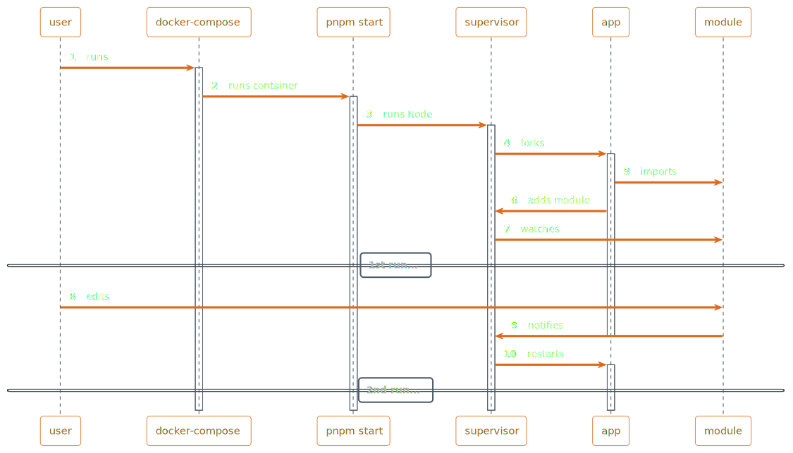

# Ganesha: Live Mode

Enable by setting the `Ganesha_Live` environment variable
to a truthy value, e.g.

```sh
Ganesha_Live=1 ganesha-run LIVE.ts.md
```

## Example usage with `docker-compose` and `pnpm`


